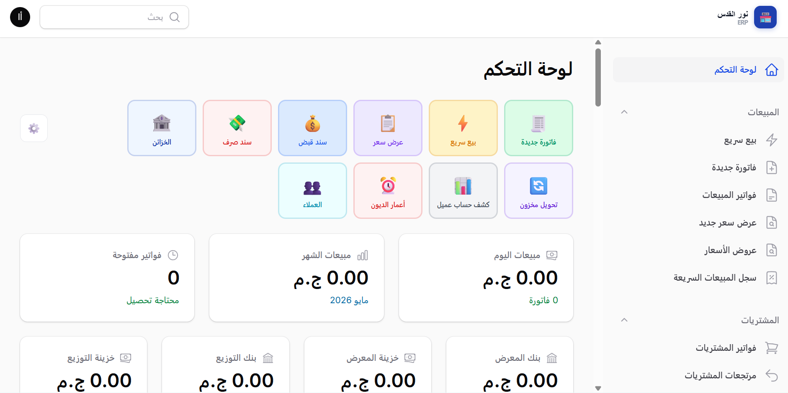
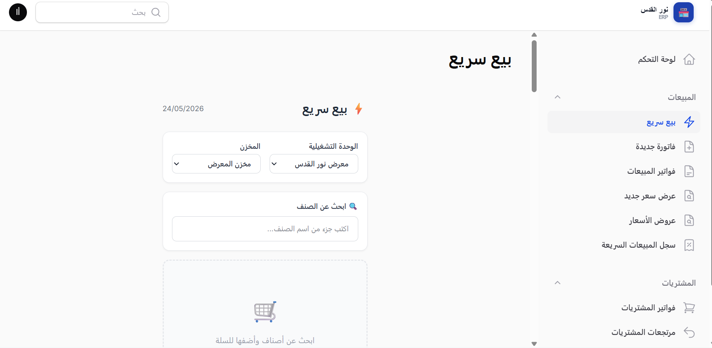
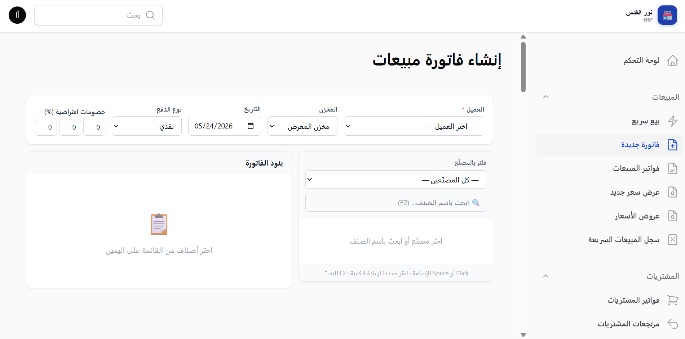
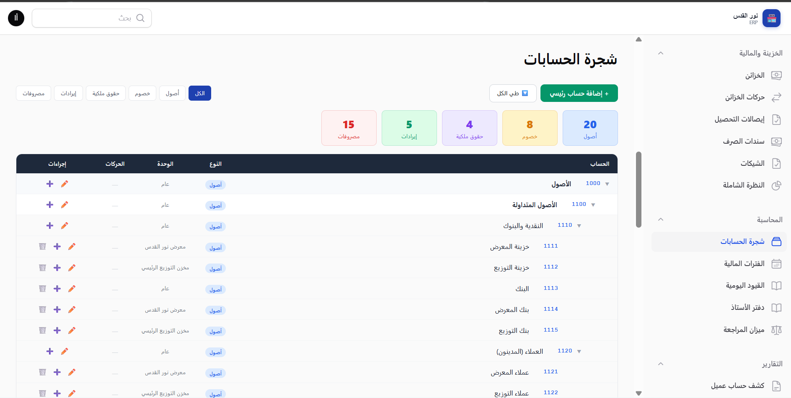
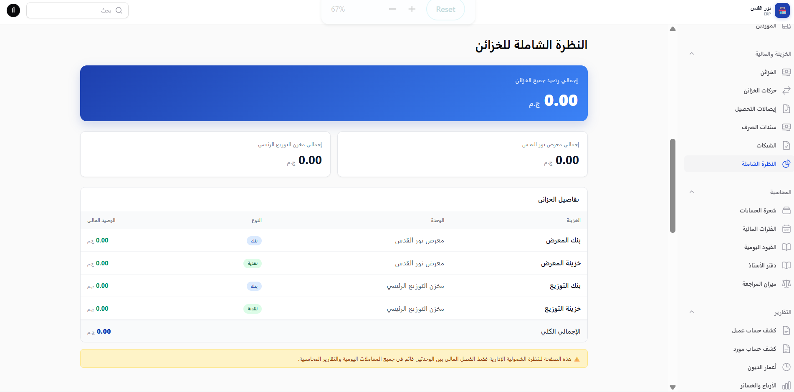
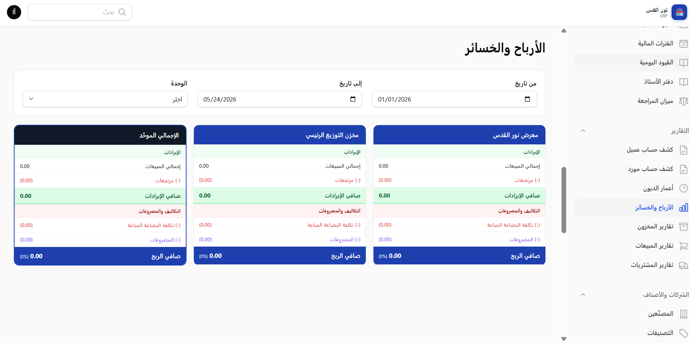
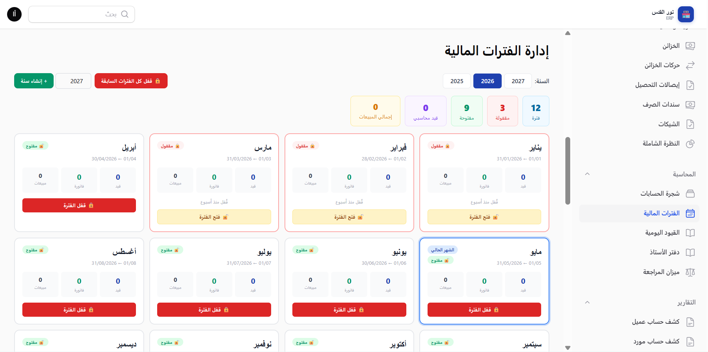
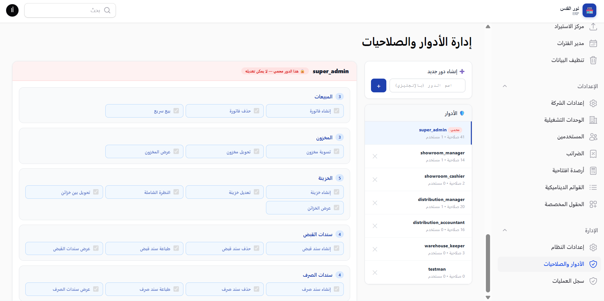
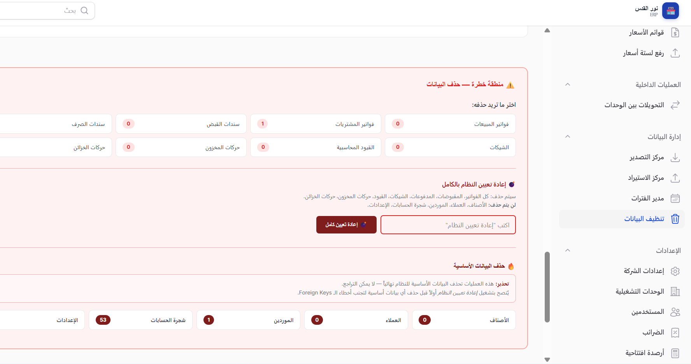
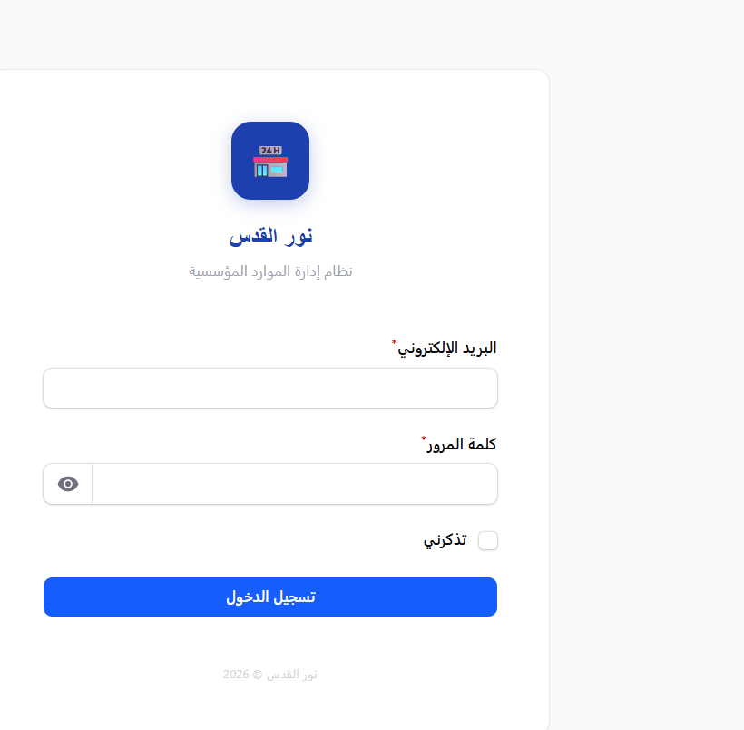

<div align="center">

# 🏪 نور القدس ERP

**نظام تخطيط موارد المؤسسات لتوزيع وبيع الأدوات الصحية والسباكة**

_An Arabic-first ERP for sanitary-ware & plumbing distribution_

[](https://github.com/KhaledMD4321/nour-al-quds/actions/workflows/ci.yml)
&nbsp;


</div>

---

<div dir="rtl">

## 📖 نظرة عامة

نظام ERP متكامل مبني خصيصاً لشركة **نور القدس** لإدارة توزيع وبيع الأدوات الصحية والسباكة في مصر، مع **فصل مالي كامل** بين وحدتين تشغيليتين تحت إدارة واحدة:

- 🏬 **المعرض** — بيع تجزئة
- 🏭 **مخزن التوزيع** — بيع جملة

الواجهة بالكامل **عربية (RTL)**، والطباعة A4 عربية عبر mPDF.

</div>

## ✨ المميزات (Features)

<div dir="rtl">

- 🧾 **المبيعات** — فواتير، مرتجعات، عروض أسعار، بيع سريع، خصم ثلاثي متتابع، حدّ ائتمان
- 🛒 **المشتريات** — فواتير شراء، مرتجعات، استيراد البنود من Excel
- 📦 **المخزون** — أرصدة لحظية، حركات مخزون، تنبيهات نقص المخزون
- 💰 **الخزينة والمالية** — سندات قبض/صرف، شيكات مؤجلة، خزائن وبنوك
- 📒 **المحاسبة** — قيود يومية أوتوماتيكية متوازنة، شجرة حسابات، دفتر أستاذ، ميزان مراجعة
- 🧮 **كشوف الحساب** — عملاء وموردين عبر `LedgerService` (مصدر حساب موحّد واحد)
- 📊 **التقارير** — أعمار الديون، الأرباح والخسائر، المخزون، المبيعات، التدفق النقدي
- 🖨️ **الطباعة المزدوجة** — معاينة في المتصفح + تنزيل PDF عربي (A4)
- 🔐 **الصلاحيات** — أدوار ومستخدمون عبر Spatie Permission
- ⚙️ **الإعدادات** — إعدادات النظام وتفعيل/تعطيل الوحدات

</div>

## 📸 لقطات الشاشة (Screenshots)

<div align="center">
<table>
  <tr>
    <td width="50%" align="center"><b>لوحة التحكم</b><br></td>
    <td width="50%" align="center"><b>البيع السريع</b><br></td>
  </tr>
  <tr>
    <td align="center"><b>إنشاء فاتورة مبيعات</b><br></td>
    <td align="center"><b>شجرة الحسابات</b><br></td>
  </tr>
  <tr>
    <td align="center"><b>النظرة الشاملة للخزائن</b><br></td>
    <td align="center"><b>الأرباح والخسائر</b><br></td>
  </tr>
  <tr>
    <td align="center"><b>إدارة الفترات المالية</b><br></td>
    <td align="center"><b>الأدوار والصلاحيات</b><br></td>
  </tr>
  <tr>
    <td align="center"><b>إدارة وتنظيف البيانات</b><br></td>
    <td align="center"><b>تسجيل الدخول</b><br></td>
  </tr>
</table>

<sub>المزيد من الشاشات (التقارير، قوائم الأسعار، التحويلات بين الوحدات…) في مجلد <a href="docs/screenshots">docs/screenshots</a></sub>

</div>

## 🛠️ التقنيات (Tech Stack)

| الطبقة | التقنية |
|--------|---------|
| Backend | Laravel 11 · PHP 8.4 |
| Admin Panel | Filament 5 (Livewire 3) |
| Database | PostgreSQL 16 |
| Auth / RBAC | Spatie Laravel Permission |
| PDF | mPDF (Arabic RTL — `xbriyaz`) |
| Excel | Maatwebsite/Excel |
| Backup | spatie/laravel-backup |

## 🏗️ المعمارية (Architecture)

<div dir="rtl">

- **منطق الأعمال في Services فقط** (`app/Modules/*`) — الـ Resources واجهة فقط
- كل عملية مالية داخل `DB::transaction()` مع `lockForUpdate()` على المخزون والخزينة
- **Soft Deletes** على كل الجداول التجارية (أرشفة لا حذف)
- كل معاملة تولّد **قيد يومي متوازن** (مدين = دائن)
- الفصل المالي بين الوحدتين قرار معماري

</div>

```
app/Modules/         ← منطق الأعمال (★ القلب)
├── Sales/  Purchases/  Inventory/  Catalog/
├── Finance/  Accounting/  Reports/  DataManagement/
app/Filament/        ← الواجهة (Resources · Pages · Widgets)
app/Models/          ← Eloquent Models
```

## 🚀 التشغيل محلياً (Local Setup)

```bash
git clone https://github.com/KhaledMD4321/nour-al-quds.git
cd nour-al-quds

composer install
cp .env.example .env
php artisan key:generate
# عدّل إعدادات قاعدة البيانات (DB_*) في .env ثم:

php artisan migrate
php artisan db:seed --class=SystemSettingSeeder
php artisan db:seed --class=ModuleSeeder
php artisan app:prepare-storage
php artisan storage:link

php artisan serve
```

> ℹ️ يتطلب **PHP 8.4+** و **PostgreSQL 16+**.

## 🧪 الاختبارات (Testing)

```bash
composer test      # تشغيل مجموعة اختبارات PHPUnit
composer lint      # فحص التنسيق (Pint)
composer format    # إصلاح التنسيق تلقائياً (Pint)
```

> الـ CI على GitHub Actions يشغّل الاختبارات + فحص التنسيق + فحص ثغرات التبعيات على كل رفع.

## 📦 النشر (Deployment)

قائمة النشر الكاملة في [`CLAUDE.md`](CLAUDE.md). باختصار على السيرفر (PHP 8.4):

```bash
composer install --no-dev --optimize-autoloader
php artisan migrate --force
php artisan app:prepare-storage
php artisan config:cache && php artisan route:cache && php artisan view:cache
```

## 🔒 الأمان (Security)

- جلسة 30 دقيقة · حد محاولات الدخول (Rate limiting) · نسخ احتياطي يومي
- فحص ثغرات التبعيات تلقائياً عبر `composer audit` ضمن الـ CI

## 📄 الترخيص (License)

برمجية خاصة (Proprietary) — جميع الحقوق محفوظة لشركة **نور القدس**.

---

<div align="center">

صُنع بعناية لإدارة أعمال نور القدس 🇪🇬

</div>
